# Terraform AWS Web Infrastructure
Terraform project that deploys a highly available AWS website using VPC, EC2, an Application Load Balancer, Auto Scaling, IAM and CloudWatch.

## Project Overview

In this project, I used Terraform to build a highly available web infrastructure in AWS.

Instead of manually creating resources through the AWS Management Console, I defined the complete infrastructure as code. This allowed me to create, verify, update and destroy the environment using Terraform commands.

The infrastructure includes a custom VPC, two public subnets in different Availability Zones, an Application Load Balancer, an Auto Scaling group, EC2 instances, security groups, an IAM instance profile and CloudWatch alarms.

I also created a small website called **The World of Chickens** and automated its deployment to the EC2 instances through the launch template user data script.

The project helped me practise:

- Writing reusable Terraform modules
- Building AWS networking from the beginning
- Connecting an Application Load Balancer to an Auto Scaling group
- Restricting traffic with security group references
- Deploying website files automatically with EC2 user data
- Monitoring infrastructure with CloudWatch
- Troubleshooting unhealthy targets and HTTP 502 errors
- Safely destroying Terraform-managed infrastructure

---

## Architecture

The application follows this request flow:

```text
Internet User
      |
      v
Application Load Balancer
      |
      v
Target Group
      |
      v
Auto Scaling Group
      |
      +-----------------------+
      |                       |
      v                       v
EC2 Instance              EC2 Instance
Public Subnet 1           Public Subnet 2
Availability Zone 1       Availability Zone 2
```

When a user opens the Application Load Balancer DNS address, the load balancer receives the HTTP request.

The listener forwards the request to the target group. The target group then sends the request to one of the healthy EC2 instances running Nginx.

I placed the EC2 instances in two different Availability Zones so that the website would not depend on a single instance or a single Availability Zone.

---

## AWS Services Used

I used the following AWS services:

- **Amazon VPC** to create an isolated network
- **Public subnets** to distribute resources across two Availability Zones
- **Internet Gateway** to provide internet connectivity
- **Route table** to route internet traffic
- **Application Load Balancer** to distribute incoming HTTP requests
- **EC2** to host the Nginx website
- **EC2 Launch Template** to define how new instances are created
- **EC2 Auto Scaling** to maintain the required number of instances
- **IAM** to provide an instance role and instance profile
- **CloudWatch** to monitor CPU usage and unhealthy targets
- **AWS Systems Manager** permissions to manage the instances without depending only on SSH

---

## Terraform Project Structure

I separated the project into network and web modules so that the code would be easier to understand, maintain and reuse.

```text
Terraform-Code/
├── Modules/
│   ├── Network/
│   │   ├── main.tf
│   │   ├── outputs.tf
│   │   └── variables.tf
│   └── Web/
│       ├── main.tf
│       ├── outputs.tf
│       └── variables.tf
├── Templates/
│   └── user_data.sh.tftpl
├── Website/
│   ├── chickens.jpg
│   ├── index.html.tftpl
│   └── style.css
├── .gitignore
├── .terraform.lock.hcl
├── locals.tf
├── main.tf
├── outputs.tf
├── providers.tf
├── variables.tf
└── versions.tf
```

The root Terraform configuration connects the two modules.

The `Network` module creates the VPC, subnets, Internet Gateway, routes and route table associations.

The `Web` module creates the security groups, IAM resources, launch template, Application Load Balancer, target group, listener, Auto Scaling group and CloudWatch alarms.

The `Templates` directory contains the EC2 user data script, while the `Website` directory contains the HTML template, CSS and website image.

---

## Network Design

### VPC

I created a dedicated VPC called `terraform-webpage`.

The VPC provides the network boundary for the project. The subnets, routing components, load balancer and EC2 instances were all created inside this VPC.

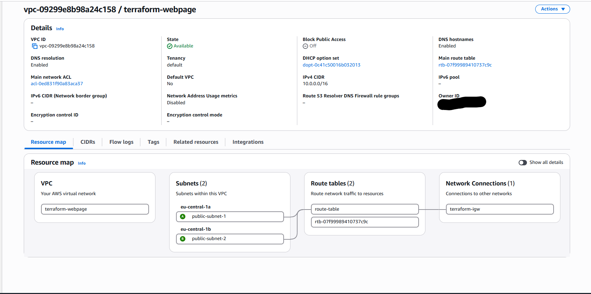

### Public Subnets

I used two public subnets and placed them in separate Availability Zones.

Using two Availability Zones allowed the Application Load Balancer and Auto Scaling group to distribute the workload instead of relying on one location.

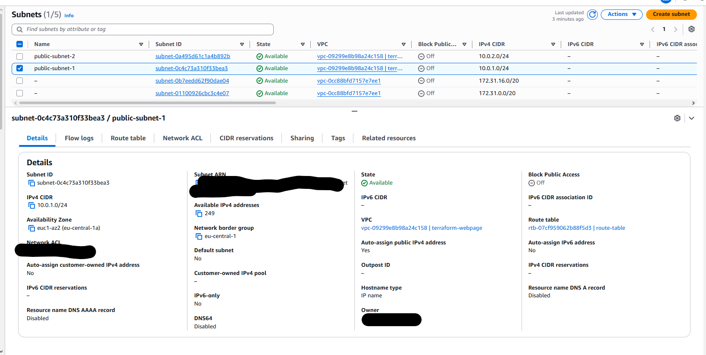

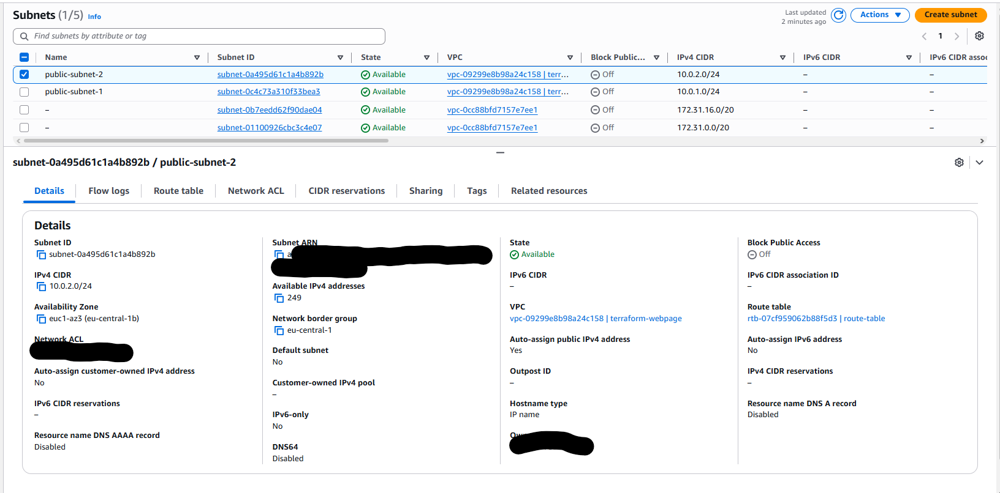

### Internet Gateway

I also attached an Internet Gateway called `terraform-igw` to the VPC.

The Internet Gateway allows resources using the public route table to communicate with the internet.

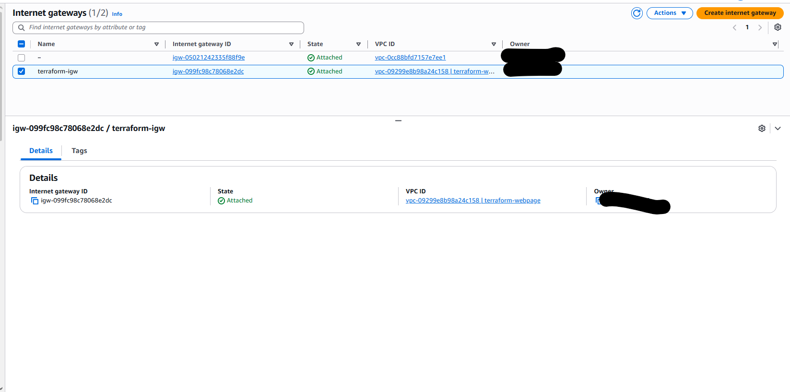

### Route Table

At the same time, I created a route table called `route-table` with a default route to the Internet Gateway.

The route:

```text
0.0.0.0/0 -> Internet Gateway
```

allows internet-bound IPv4 traffic to leave the VPC.

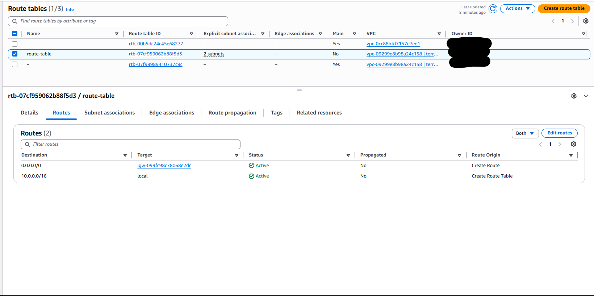

I then associated both public subnets with the route table.

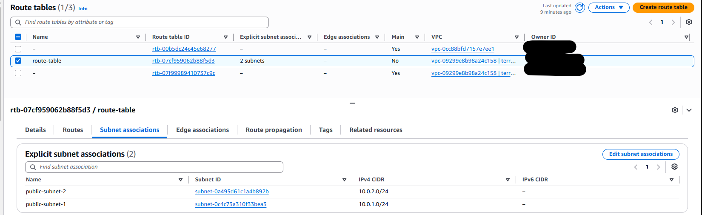

---

## Security Group Design

I created separate security groups for the Application Load Balancer and EC2 instances.

### Application Load Balancer Security Group

The `ALB-security` security group allows inbound HTTP traffic on port `80` from the internet.

This is necessary because the Application Load Balancer is the public entry point for the website.

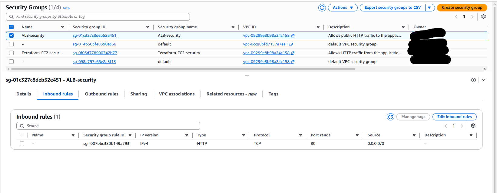

### EC2 Security Group

The `Terraform-EC2-security` security group allows HTTP traffic on port `80` only when it comes from the Application Load Balancer security group.

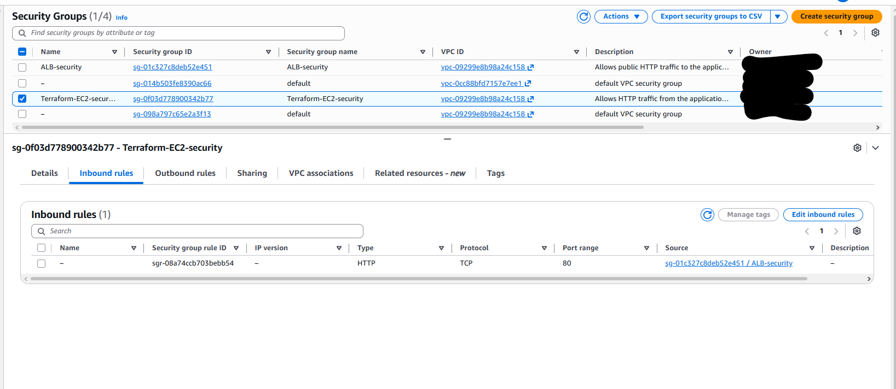

I did not expose port `80` on the EC2 instances directly to the entire internet.

The traffic path is therefore:

```text
Internet -> ALB security group -> EC2 security group
```

Using a security group reference means the EC2 instances accept website traffic from the load balancer, rather than from any public IP address.

---

## EC2 Launch Template

Created a launch template called `terraform-launch`.

The launch template defines the configuration used whenever the Auto Scaling group creates a new EC2 instance.

It contains information such as:

- Amazon Machine Image
- EC2 instance type
- IAM instance profile
- EC2 security group
- User data deployment script
- Resource tags

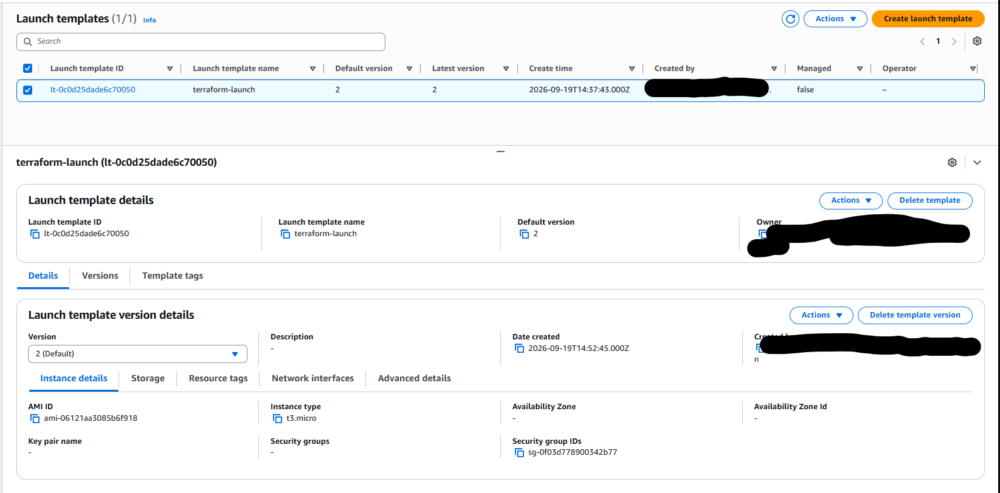

By placing the instance configuration inside a launch template, I ensured that every instance created by the Auto Scaling group uses the same configuration.

---

## Automated Website Deployment

Automated the website installation through `user_data.sh.tftpl`.

Before creating the launch template, Terraform reads the website files using `templatefile()` and converts the HTML and CSS content to Base64.

The rendered values are passed into the user data template.

When a new EC2 instance starts, the script:

1. Updates the operating system packages
2. Installs Nginx
3. Recreates the HTML file
4. Recreates the CSS file
5. Downloads the website image
6. Enables Nginx
7. Starts the Nginx service

This means I did not need to connect to each EC2 instance and configure the website manually.

Any replacement instance created by the Auto Scaling group can deploy the same website automatically.

---

## EC2 Instances

The Auto Scaling group launched the EC2 instances using the launch template.

I applied the `Terraform-EC2` name tag so that the instances were easy to identify in the AWS console.

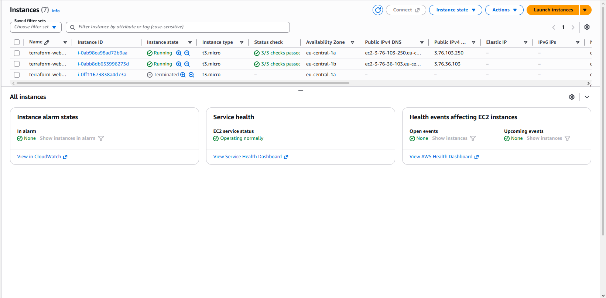

The instances run Nginx and serve the website on port `80`.

Because the instances are managed by the Auto Scaling group, they should not be treated as individually managed servers. If an instance becomes unhealthy, the Auto Scaling group can replace it using the launch template.

---

## Application Load Balancer

Created an internet-facing Application Load Balancer called `terraform-alb`.

The load balancer was deployed across both public subnets.

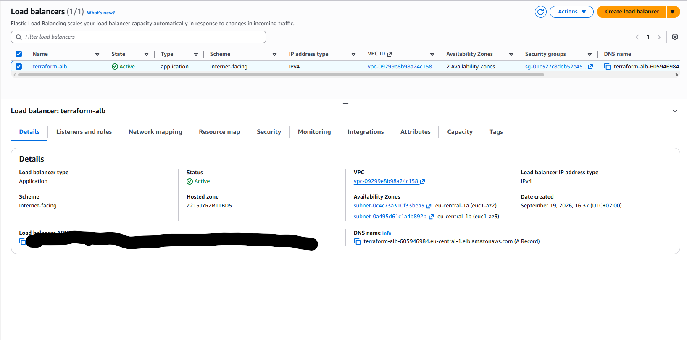

The Application Load Balancer provides one DNS address for the website and distributes requests between the available healthy EC2 instances.

### Listener

Also created an HTTP listener on port `80`.

The listener forwards incoming requests to the target group.

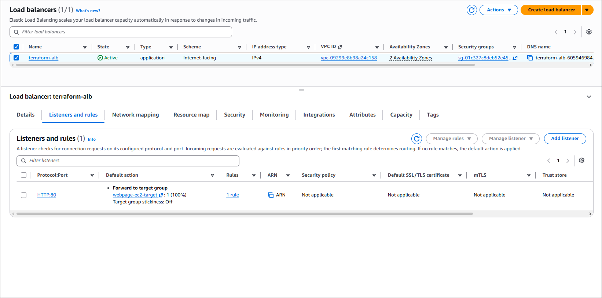

---

## Target Group and Health Checks

Target group called `webpage-ec2-target` was created.

The Auto Scaling group registers its EC2 instances with this target group.

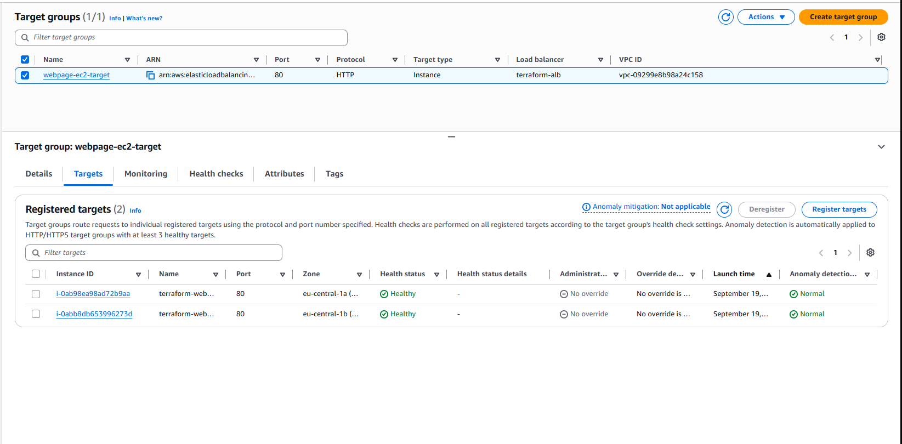

The target group performs health checks against the instances. An instance must successfully respond to the health check before the load balancer sends normal website traffic to it.

This protects users from being sent to an instance where Nginx failed to start or the website was not deployed correctly.

---

## Auto Scaling Group

I, of course needed to  create an Auto Scaling group called `terraform-asg`.

The group maintains two EC2 instances and distributes them across the two public subnets.

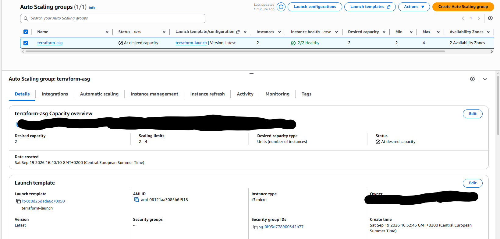

The Auto Scaling group uses the launch template when it needs to create an instance.

It is also connected to the Application Load Balancer target group, allowing new instances to be registered automatically.

This design provides better availability than hosting the website on one manually created EC2 instance.

---

## IAM Configuration

I created an IAM role and attached it to the EC2 instances through an instance profile.

The role allows the instances to work with AWS Systems Manager.

Using an IAM role is safer than storing permanent AWS access keys on the EC2 instances. AWS provides temporary credentials to the instance based on the permissions attached to the role.

---

## CloudWatch Monitoring

Finally I also created two CloudWatch alarms:

- `Unhealthy-targets`
- `High-CPU`

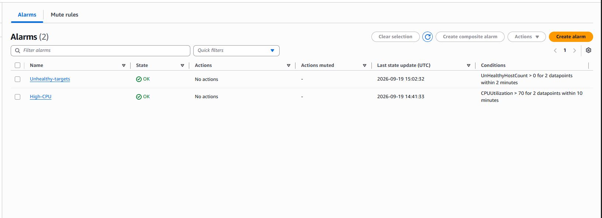

The unhealthy target alarm monitors whether the load balancer target group contains unhealthy EC2 instances.

The high CPU alarm monitors the EC2 infrastructure for unusually high CPU utilisation.

These alarms gave me visibility into both application availability and instance resource usage.

---

## Website Result

After both targets became healthy, I opened the Application Load Balancer DNS address in a browser.

The load balancer successfully forwarded the request to the EC2 instances and displayed the website.

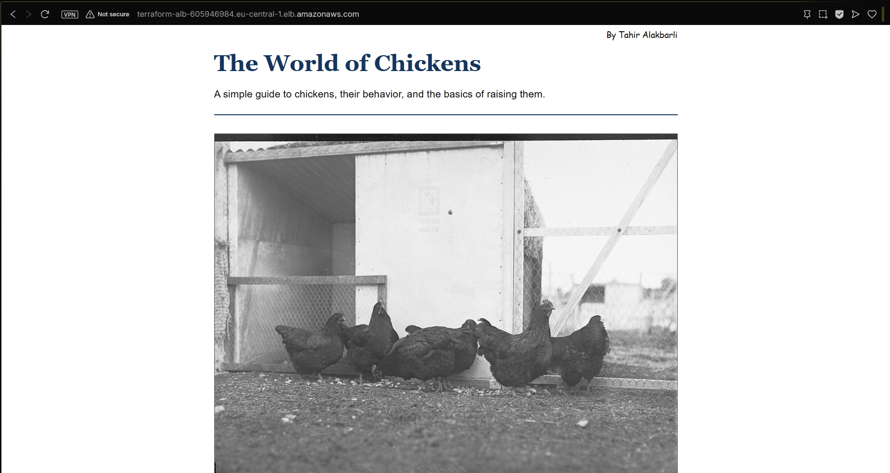

This confirmed that the following components were working together:

- VPC routing
- Public subnet configuration
- Internet Gateway
- Application Load Balancer
- Listener
- Target group
- Security groups
- Auto Scaling group
- EC2 launch template
- Nginx
- EC2 user data

---

## Deployment Steps

### 1. Clone the Repository

```bash
git clone https://github.com/Tahir-Alakbarli/Terraform-aws-web-infrastructure.git
cd Terraform-aws-web-infrastructure/Terraform-Code
```

### 2. Confirm AWS Authentication

```bash
aws sts get-caller-identity
```

This command confirms which AWS account and IAM identity Terraform will use.

### 3. Initialise Terraform

```bash
terraform init
```

This downloads the required provider and initialises the network and web modules.

### 4. Format the Terraform Files

```bash
terraform fmt -recursive
```

### 5. Validate the Configuration

```bash
terraform validate
```

Expected result:

```text
Success! The configuration is valid.
```

### 6. Review the Execution Plan

```bash
terraform plan
```

I reviewed the plan before deployment to confirm which AWS resources Terraform intended to create or change.

### 7. Deploy the Infrastructure

```bash
terraform apply
```

After reviewing the final plan, I entered:

```text
yes
```

### 8. View the Terraform Outputs

```bash
terraform output
```

The outputs provide the information required to locate and test the deployed infrastructure.

### 9. Test the Website

I copied the Application Load Balancer DNS name and opened it in a browser.

I also tested the HTTP response from Ubuntu:

```bash
curl -I http://<ALB-DNS-NAME>
```

A successful response returns:

```text
HTTP/1.1 200 OK
```

---

## Infrastructure Verification

After deployment, I ran another Terraform plan:

```bash
terraform plan
```

Terraform reported that the deployed AWS infrastructure matched the configuration and that no additional changes were required.

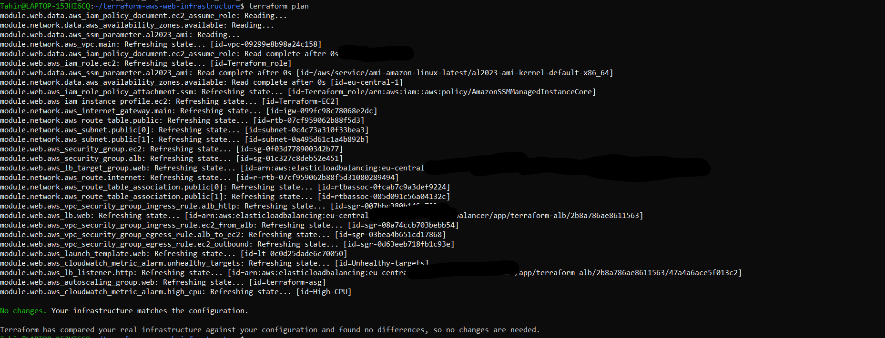

This final plan was important because it confirmed that the deployment had reached the intended state without configuration drift.

---

## Main Challenge: Application Load Balancer 502 Error

The hardest problem I encountered was an initial:

```text
502 Bad Gateway
```

The Application Load Balancer was reachable, but its targets were unhealthy.

The original user data script contained:

```bash
dnf install -y nginx curl
```

The Amazon Linux image already included `curl-minimal`. Attempting to install the full `curl` package created a package conflict.

Because the script used:

```bash
set -euo pipefail
```

the user data script stopped as soon as the package installation failed.

As a result:

- Nginx was not completely configured
- The website files were not deployed
- The target group health checks failed
- The Application Load Balancer returned a 502 response

I fixed the problem by changing the installation command to:

```bash
dnf install -y nginx
```

The existing `curl-minimal` package was sufficient for downloading the website image, so installing the full `curl` package was unnecessary.

After updating the Terraform configuration, I applied the change and allowed the Auto Scaling group to replace the affected instances.

The new instances completed the user data script successfully, Nginx started correctly, both targets became healthy and the website returned:

```text
HTTP/1.1 200 OK
```

This problem showed me that a reachable load balancer does not automatically mean the application behind it is healthy. I had to check the target health, the EC2 user data process and the package installation behaviour to identify the real cause.

---

## Security Considerations

I applied several security practices in this project:

- Allowed public HTTP traffic to the Application Load Balancer, not directly to the EC2 instances.
- Restricted EC2 HTTP access to the Application Load Balancer security group.
- Used an IAM role instead of placing permanent AWS credentials on the instances.
- Excluded local Terraform state and variable files through `.gitignore`.
- Used AWS Systems Manager permissions to support instance management.
- Reviewed the Terraform plan before applying infrastructure changes.
- Destroyed the infrastructure after completing the project to avoid unnecessary AWS costs.

For a production environment, I would also add HTTPS, an ACM certificate, a domain name and stricter outbound security group rules.

---

## What I Learned

This project gave me practical experience with how multiple AWS services must work together to deliver one web application.

I learned how to:

- Organise Terraform code using modules
- Pass outputs from a network module into a web module
- Build a VPC and public routing configuration
- Deploy an Application Load Balancer across multiple Availability Zones
- Connect an Auto Scaling group to a target group
- Use security group references instead of public EC2 access
- Use `templatefile()` to build an EC2 user data script
- Encode website content before including it in user data
- Diagnose unhealthy load balancer targets
- Troubleshoot a failed Amazon Linux package installation
- Confirm infrastructure state with `terraform plan`
- Remove all project resources safely with `terraform destroy`

The most useful lesson was learning to troubleshoot the complete request path instead of looking at only one AWS resource.

---

## Cost Management and Cleanup

After collecting the required screenshots and confirming that the website worked, I destroyed the infrastructure.

```bash
terraform destroy
```

I reviewed the destroy plan and entered:

```text
yes
```

I then confirmed that Terraform no longer had managed resources:

```bash
terraform state list
```

The command returned no resources.

Destroying the environment removed the chargeable project resources, including the Application Load Balancer and EC2 instances.

Terraform state files and real variable files are excluded from the repository because they can contain environment-specific or sensitive information.

---

## Future Improvements

If I continue developing this project, I would add:

- HTTPS using AWS Certificate Manager
- A custom domain using Amazon Route 53
- Private subnets for the EC2 instances
- A NAT Gateway or VPC endpoints for controlled outbound connectivity
- S3 and DynamoDB for remote Terraform state and state locking
- SNS notifications for CloudWatch alarms
- Auto Scaling policies based on CPU usage or request count
- AWS WAF protection for the Application Load Balancer
- A CI/CD pipeline for Terraform validation and deployment
- Automated tests for the user data script and website response

---

## Sources and References

I used the official Terraform documentation to understand the resource arguments and connections required for the infrastructure.

### Terraform and AWS Provider

- [Terraform AWS Provider](https://registry.terraform.io/providers/hashicorp/aws/latest/docs)
- [Terraform AWS VPC Resource](https://registry.terraform.io/providers/hashicorp/aws/latest/docs/resources/vpc)
- [Terraform AWS Subnet Resource](https://registry.terraform.io/providers/hashicorp/aws/latest/docs/resources/subnet)
- [Terraform AWS Internet Gateway Resource](https://registry.terraform.io/providers/hashicorp/aws/latest/docs/resources/internet_gateway)
- [Terraform AWS Route Table Resource](https://registry.terraform.io/providers/hashicorp/aws/latest/docs/resources/route_table)
- [Terraform AWS Route Resource](https://registry.terraform.io/providers/hashicorp/aws/latest/docs/resources/route)
- [Terraform AWS Route Table Association Resource](https://registry.terraform.io/providers/hashicorp/aws/latest/docs/resources/route_table_association)

### References for the Hardest Parts

These were the most important references for connecting the launch template, Auto Scaling group, target group and load balancer:

- [Terraform AWS Launch Template Resource](https://registry.terraform.io/providers/hashicorp/aws/latest/docs/resources/launch_template)
- [Terraform AWS Auto Scaling Group Resource](https://registry.terraform.io/providers/hashicorp/aws/latest/docs/resources/autoscaling_group)
- [Terraform AWS Application Load Balancer Resource](https://registry.terraform.io/providers/hashicorp/aws/latest/docs/resources/lb)
- [Terraform AWS Load Balancer Listener Resource](https://registry.terraform.io/providers/hashicorp/aws/latest/docs/resources/lb_listener)
- [Terraform AWS Load Balancer Target Group Resource](https://registry.terraform.io/providers/hashicorp/aws/latest/docs/resources/lb_target_group)

The Auto Scaling group documentation was particularly important because I needed to connect the group to `target_group_arns`, use ELB health checks and control how instances were replaced after launch template changes.

The launch template documentation helped me configure the IAM instance profile, security group, tags and Base64-encoded user data correctly.

The target group documentation helped me understand target health checks and why the load balancer returned a 502 response while the instances were unhealthy.

### Security and IAM References

- [Terraform AWS Security Group Resource](https://registry.terraform.io/providers/hashicorp/aws/latest/docs/resources/security_group)
- [Terraform AWS VPC Security Group Ingress Rule](https://registry.terraform.io/providers/hashicorp/aws/latest/docs/resources/vpc_security_group_ingress_rule)
- [Terraform AWS VPC Security Group Egress Rule](https://registry.terraform.io/providers/hashicorp/aws/latest/docs/resources/vpc_security_group_egress_rule)
- [Terraform AWS IAM Role Resource](https://registry.terraform.io/providers/hashicorp/aws/latest/docs/resources/iam_role)
- [Terraform AWS IAM Role Policy Attachment](https://registry.terraform.io/providers/hashicorp/aws/latest/docs/resources/iam_role_policy_attachment)
- [Terraform AWS IAM Instance Profile](https://registry.terraform.io/providers/hashicorp/aws/latest/docs/resources/iam_instance_profile)

### Monitoring References

- [Terraform AWS CloudWatch Metric Alarm Resource](https://registry.terraform.io/providers/hashicorp/aws/latest/docs/resources/cloudwatch_metric_alarm)

### Terraform Template References

- [Terraform `templatefile` Function](https://developer.hashicorp.com/terraform/language/functions/templatefile)
- [Terraform `base64encode` Function](https://developer.hashicorp.com/terraform/language/functions/base64encode)

I used `templatefile()` to render the user data script and website HTML. I used `base64encode()` to safely pass the website files through the launch template user data.

### Website Content Sources

- [Chicken – Wikipedia](https://en.wikipedia.org/wiki/Chicken)
- [Poultry Farming – Wikipedia](https://en.wikipedia.org/wiki/Poultry_farming)
- [Rooster and Chickens Image – Wikimedia Commons](https://commons.wikimedia.org/wiki/File:Rooster_and_Chickens(GN00657).jpg)

---

## AI Assistance

I used AI as a supporting tool during this project. AI helped me improve the reliability of the EC2 user data script by suggesting:

```bash
set -euo pipefail
```

This makes the script stop when a command fails, when an undefined variable is used or when a command inside a pipeline fails.

I also used AI while troubleshooting the `502 Bad Gateway` error. It helped me investigate the EC2 user data script and identify the package conflict between `curl` and the preinstalled `curl-minimal` package. I reviewed the suggested solution, updated the script and verified the fix by confirming that both targets became healthy and the website returned an HTTP `200 OK` response.
